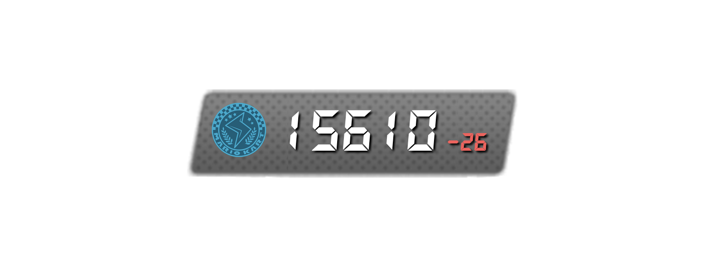
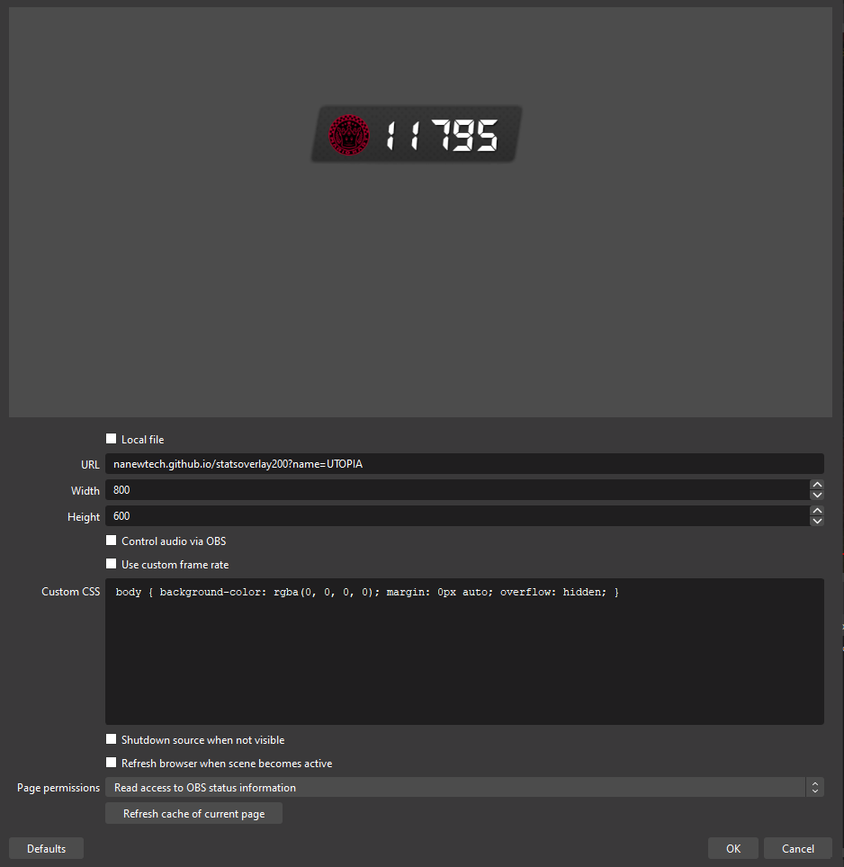
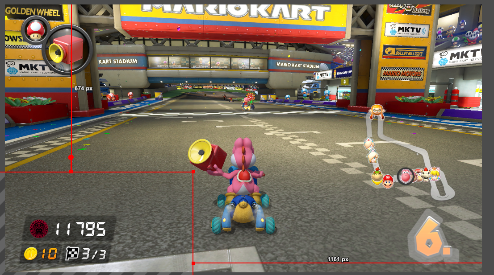

# [statsoverlay150](https://statsoverlay.prismillon.com)

This is a mmr overlay for the 150cc mk8dx lounge that auto update.

An alternative for 200cc lounge exist at [github.com/nanewtech/statsoverlay200](https://github.com/nanewtech/statsoverlay200)

# Usage
#### When opening the Link to the Website [statsoverlay.prismillon.com](https://statsoverlay.prismillon.com) you will see a page that prompt you to add `?name=<your_name_here>` in the url

You should now add your **150 Lounge** username to the end of the link in the following format

```
statsoverlay.prismillon.com?name=<YOUR_LOUNGE_NAME_HERE>
```
When you have added your username enter the page and it will look something like this:


To now add this to your stream open OBS (or any other streaming software with similar capabilities) and add a browser source to the scene.
the browser source should look something like this:



AFter pressing OK you can now position the overlay into any position and resize it to any size you see fit. one such usecase could look like this:




## Getting Started

First, run the development server:

```bash
npm run dev
# or
yarn dev
# or
pnpm dev
# or
bun dev
```

Open [http://localhost:3000](http://localhost:3000) with your browser to see the result.

You can start editing the page by modifying `app/page.tsx`. The page auto-updates as you edit the file.